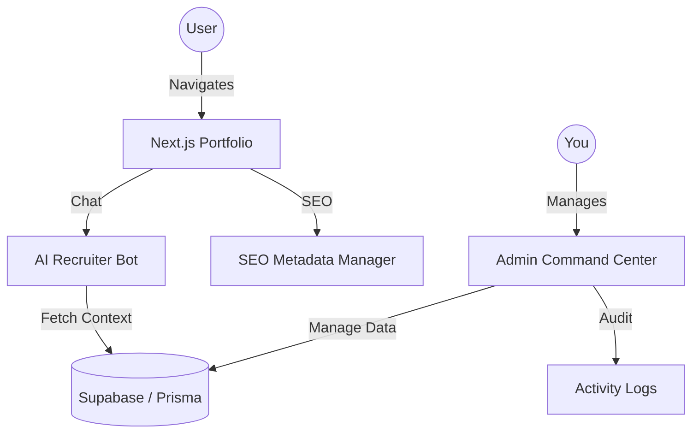

# 🛰️ Portfolio HQ — vanhkhuc.dev


A high-performance, AI-integrated personal branding ecosystem and command center. Built to demonstrate advanced fullstack capabilities, system observability, and autonomous AI agent integration.

---

## 🏗️ Architecture



## ✨ Key Features

- **AI Recruiter Bot**: A context-aware agent trained on my career data using RAG (Retrieval-Augmented Generation).
- **Admin Command Center**: Full CRUD for Projects, Blogs, Skills, and Experience with built-in Media Upload (Supabase Storage).
- **System Observability**: Integrated Activity Logging to track all system changes.
- **Advanced SEO**: Dynamic metadata management for every page.
- **Premium UX**: Framer Motion animations, Bento-style layouts, and professional aesthetic.

## 🛠️ Tech Stack

- **Framework**: Next.js 15 (App Router)
- **Database**: PostgreSQL (Supabase)
- **ORM**: Prisma 7
- **AI**: Vercel AI SDK + Google Gemini 1.5 Flash
- **Styling**: Tailwind CSS + Framer Motion
- **Language**: TypeScript

---

## 🚀 Development

### Prerequisites
- [Node.js 20+](https://nodejs.org/)
- [Supabase](https://supabase.com/) account for Database & Storage

### Setup
1. Clone the repository
2. Install dependencies:
   ```bash
   npm install
   ```
3. Initialize Database:
   ```bash
   npx prisma migrate dev
   npx prisma generate
   ```
4. Run development server:
   ```bash
   npm run dev
   ```

---

## 📄 License

This project is open-source and available under the MIT License.

---

<p align="center">
  Built with ❤️ by <a href="https://vanhkhuc.dev">BanhKhuc04</a>
</p>
